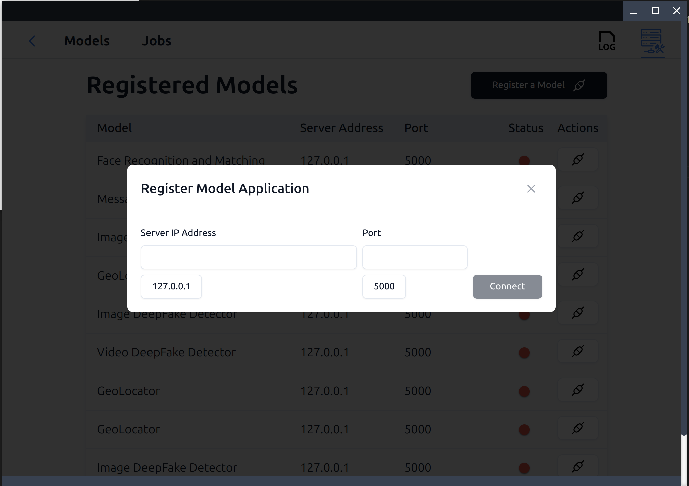
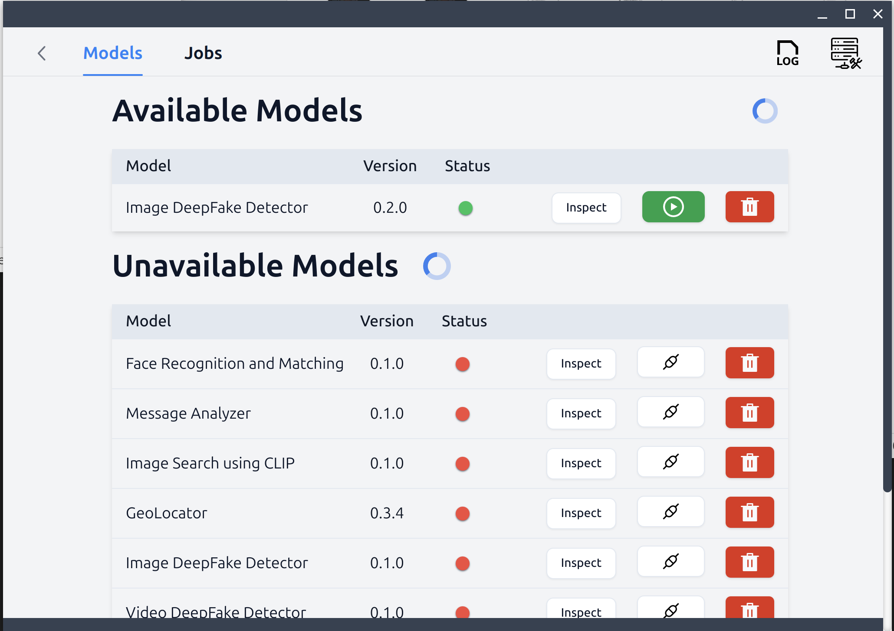
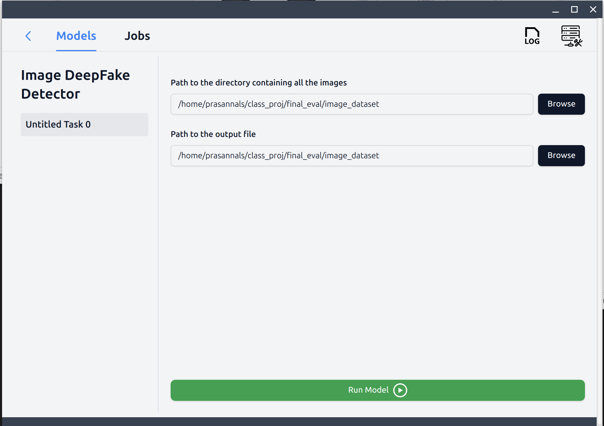
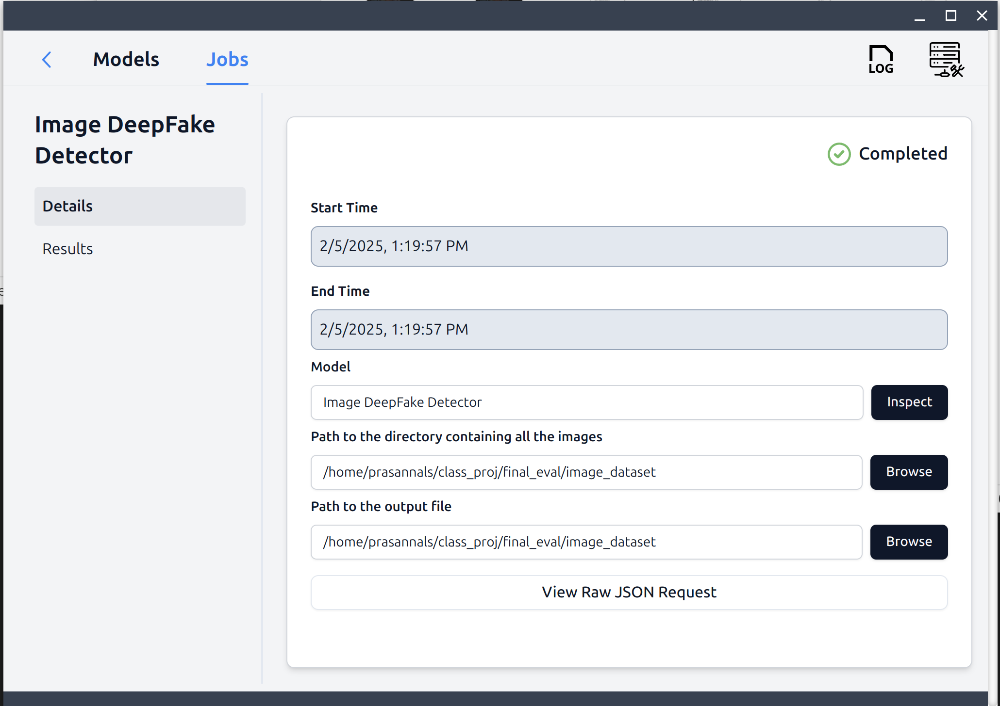

# DeepFake Image Classifier ONNX model
This repo demonstrates an example of how to run ONNX models. This example is aimed to help guide students in the first assignment in the Spring offering of 596E. Further improves can be made, especially when it comes to removing unnecessary dependencies (but this isn't a requirement in the first assignment).

This example uses a deep fake model that was originally created by students in the Fall 2024 offering of 596E. The model has been modified to work with ONNX models. The model is used to classify images as either real or fake.

## Steps to export the ONNX model

The following steps were taken to export the ONNX model.
1. Clone and set up the DeepFake repo found [here](https://github.com/aravadikesh/DeepFakeDetector/). Follow instructions on README.md to get the deep fake model running.
2. Configure [Rescue Box Desktop](https://github.com/UMass-Rescue/RescueBox-Desktop/releases) to work with the DeepFake repo. To test that the application works, send an example request where the input is the "images" folder from this (deepfake-image-onnx) repo. Once you get the deep fake model working, proceed to the next step.
3. Set a breakpoint at Line 95, right before the `output = net(image)` call in the `predict` function in `model_server.py`.
4. Send a request to the Deepfake backend again using the same inputs from the RescueBox Desktop application. The breakpoint will be triggered in the backend.
5. Run the following python code to export the ONNX model.
```
torch.onnx.export(net, image, "deepfake_model.onnx", export_params=True, opset_version=16, do_constant_folding=True, input_names=["input"], output_names=["output"], dynamic_axes={"input": {0: "batch_size"}, "output": {0: "batch_size"}})
```

The resulting ONNX model will be saved as "deepfake_model.onnx" in the directory where the `model_server.py` exists.

## Steps to use the deep fake model

### Create virtual environment and install dependencies
Create a new virtual environment using any tool you prefer. I use `pipenv` for this example. You can use `conda` or `virtualenv` as well.

```bash
pipenv shell
```

Install the dependencies using the following command:

```bash
pip install -r requirements.txt
```

### Download the model
Download the model from the following link: [DeepFake model](https://drive.google.com/file/d/1xvJrHs5aJuiVw1X0lIlBzWCEn3WzvjN0/view?usp=sharing). Place the model in the root directory of this project.

### Run the Flask-ML server

Run the following command to start the Flask-ML server:

```bash
python model_server_onnx.py
```

### Command line interface

The command line interface can be used to test the model. Run the following command to test the model:

```bash
# image_dir is the directory containing the images
python deepfake_cli.py --input_dir path/to/image_dir --output_dir path/to/output_dir
```

### Download and run RescueBox Desktop from the following link: [Rescue Box Desktop](https://github.com/UMass-Rescue/RescueBox-Desktop/releases)

#### Open the RescueBox Desktop application and register the model


#### Run the model



#### View the results


### Attribution
The deepfake model project was done by students in the Fall 24 offering of 596E. Their work has been modified to work with ONNX models here. Their repo can be found [here](https://github.com/aravadikesh/DeepFakeDetector/).

The model we're using was originally created by the authors of the following paper:

```bibtex
@InProceedings{Lanzino_2024_CVPR,
    author    = {Lanzino, Romeo and Fontana, Federico and Diko, Anxhelo and Marini, Marco Raoul and Cinque, Luigi},
    title     = {Faster Than Lies: Real-time Deepfake Detection using Binary Neural Networks},
    booktitle = {Proceedings of the IEEE/CVF Conference on Computer Vision and Pattern Recognition (CVPR) Workshops},
    month     = {June},
    year      = {2024},
    pages     = {3771-3780}
}